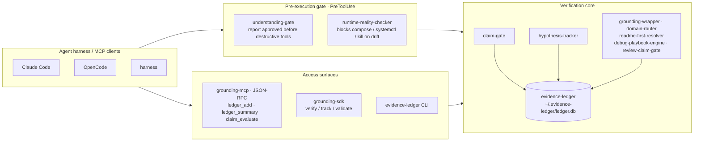

# Architecture

Agents reach the `agent-grounding` stack two ways: a **PreToolUse gate** that blocks destructive commands until claims are grounded, and **access surfaces** (MCP, SDK, CLI) over a shared evidence ledger.

## Why this exists

AI agents are good at generating plausible explanations. They're bad at verifying them. This framework enforces discipline:

- **Don't assume**: check runtime state before diagnosing.
- **Don't claim**: gate strong assertions behind evidence.
- **Don't forget**: track all hypotheses, don't silently drop them.
- **Don't skip steps**: follow diagnostic playbooks in order.
- **Don't guess scope**: route to the correct domain first.

The motivating incident lives in an internal logbook: an agent investigated two `agent-grounding` tasks against a checkout that was 16 commits behind origin, declared both "stale" because the relevant directories didn't exist locally, and only caught the drift hours later when a third task forced a fresh `git pull`. Two corrections had to be walked back. The check that would have caught it (`git fetch && git status` before any structural claim) is exactly what `runtime-reality-checker` + `claim-gate` enforce, given a runtime that consults them.

## Where this fits

`agent-grounding` is the **Validate** stage of the [Project OS](https://github.com/LanNguyenSi/project-pilot) Human-Agent Dev Lifecycle:

- [agent-planforge](https://github.com/LanNguyenSi/agent-planforge) plans
- [agent-tasks](https://github.com/LanNguyenSi/agent-tasks) coordinates
- **agent-grounding** verifies
- [agent-preflight](https://github.com/LanNguyenSi/agent-preflight) gates pushes
- [harness](https://github.com/LanNguyenSi/harness) declares + enforces the policy boundary that calls into all of the above

## Restricted documentary assessment producer

The `grounding-mcp` package also supplies `grounding-assessment-mcp`, a separate seven-tool stdio entrypoint for portable signed documentary assessments. It requires explicit issuer configuration and uses its own assessment store. See [configuration, tools, and activation boundaries](../packages/grounding-mcp/README.md#restricted-assessment-mcp). The existing `grounding-mcp` session, ledger, and verdict tools retain their current contract.
